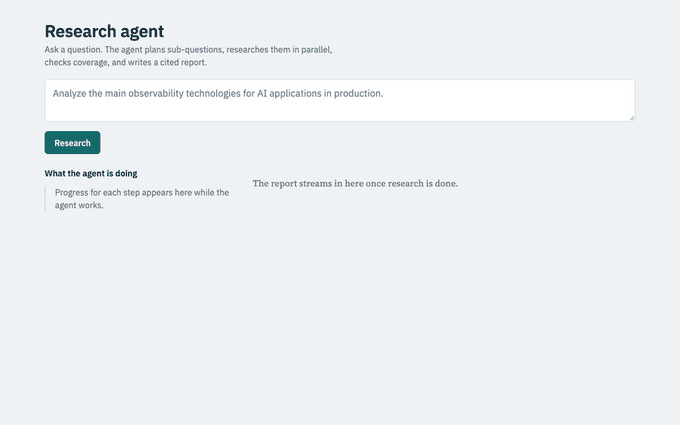
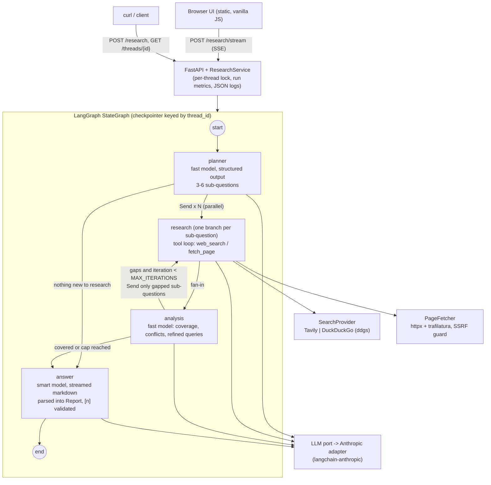
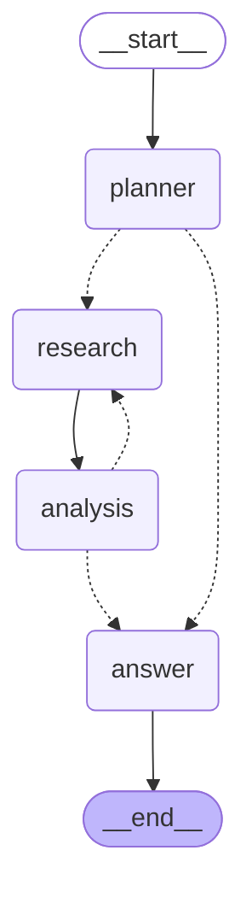

# research-agent-langgraph

A research agent that plans a question, researches sub-questions in parallel on the web, checks its own coverage, and returns a structured report with verifiable citations. Built with FastAPI, LangGraph and Claude.

[](https://github.com/CardosoGuiVi/research-agent-langgraph/actions/workflows/ci.yml)

[](LICENSE)

## Demo

> **Demo GIF placeholder:** question in, live graph trace (planner, parallel research lanes, coverage check), streamed report with clickable citations. See [Recording the demo GIF](#recording-the-demo-gif).
<!-- Replace with:  -->

```bash
curl -s -X POST localhost:8000/research \
  -H 'content-type: application/json' \
  -d '{"question": "What are the main open-source tools for tracing LLM applications?"}'
```

Response (trimmed from a real run):

```json
{
  "thread_id": "9f1c...",
  "run_id": "4b7e...",
  "report": {
    "question": "What are the main open-source tools for tracing LLM applications?",
    "summary": "The open-source LLM tracing landscape is organized around three layers: full-stack observability platforms (Langfuse, Arize Phoenix, Opik, ...), instrumentation libraries built on OpenTelemetry (OpenLLMetry, OpenInference, ...), and general-purpose tracing backends ... [1][6][7].",
    "key_findings": [
      "Langfuse is the most widely cited fully open-source (MIT) LLM tracing platform ... [1][13]",
      "Arize Phoenix is OpenTelemetry-based, framework-agnostic ... licensed under Elastic License 2.0 [25][53][79]"
    ],
    "sections": [{"title": "Full-Stack Open-Source Tracing Platforms", "content": "..."}],
    "open_questions": ["..."],
    "sources": [
      {"id": 1, "url": "https://posthog.com/blog/best-open-source-llm-observability-tools", "title": "7 best free and open source LLM observability tools", "fetched": true}
    ],
    "failed_sub_questions": [],
    "invalid_citations": [],
    "markdown": "## Summary\n..."
  },
  "usage": {
    "nodes_executed": ["planner", "research", "research", "research", "research", "analysis", "answer"],
    "tool_calls": {"web_search": 27, "fetch_page": 12},
    "input_tokens": 194063, "output_tokens": 12984,
    "tokens_by_model": {"claude-haiku-4-5-20251001": {"calls": 19}, "claude-opus-5": {"calls": 1}},
    "estimated_cost_usd": 0.413, "latency_s": 78.4, "errors": []
  }
}
```

## What this project demonstrates

- **Agent orchestration with LangGraph:** typed state and reducers, fan-out with `Send`, a conditional loop with a hard iteration cap, runtime context, streaming, and a checkpointer for thread memory.
- **Tool calling with Claude:** a bounded, custom tool loop (`web_search`, `fetch_page`) with parallel tool calls, structured outputs (JSON schema) for planning and analysis, and streamed synthesis.
- **Production concerns:** timeouts, retries with exponential backoff on transient errors only, graceful degradation, per-run budgets (searches, fetches, tokens, iterations), and cost/token accounting per run.
- **Security hygiene:** SSRF-safe page fetching (public IPs only, every redirect hop re-checked), secrets as `SecretStr` with log redaction, gitleaks in pre-commit and CI, a non-root read-only container, and XSS-safe rendering of model output.
- **Testability:** the LLM, search and fetching sit behind Protocols; 135 fast deterministic tests with fakes (96% coverage), plus opt-in live, e2e and eval suites.
- **Evaluation:** a YAML dataset, deterministic checks (schema, citation resolution, source diversity) and an LLM-as-judge with a versioned rubric. The eval caught a real citation-parsing bug (see [results](#latest-results)).

## Architecture



The diagram exported from the compiled graph (`make graph` writes [`docs/graph.mmd`](docs/graph.mmd)):



**Comparison:** the topology is identical. Dashed edges are the conditional edges (`route_after_planner`, `route_after_analysis`), and the solid `research --> analysis` edge is the fan-in. The export cannot show two things from the hand-drawn version: that `research` runs once per sub-question in parallel (`Send` is dynamic), and that the loop back to research is capped in code. The hand-drawn diagram adds those, plus the adapters behind each node.

## How it works

1. **Request:** `POST /research` (or `/research/stream`) with a question and an optional `thread_id`. The service takes a per-thread lock (runs on one thread are serialized, 409 if busy), creates a `RunScope` (budgets, search cache, metrics) and invokes the graph with it as runtime context.
2. **planner:** the fast model returns a `PlannerOutput` (JSON schema) with 3-6 sub-questions and 1-3 queries each. On a follow-up, earlier findings on the thread are in the prompt, and the planner only plans what is missing. If planning fails, the run degrades to researching the question directly.
3. **research (parallel):** one `Send` per sub-question. Each branch runs up to `MAX_RESEARCH_STEPS` tool turns. Tool calls from the same turn execute concurrently. Searches go through the per-run cache and cap. Pages are fetched with size limits and clean-text extraction. At the step cap, the model is forced (`tool_choice: none`) to write notes. A failing branch records its error and does not abort the run.
4. **fan-in:** the `merge_sources` reducer dedupes URLs and assigns citation numbers, stable across the whole thread.
5. **analysis:** the fast model rates coverage per sub-question (`sufficient` / `partial` / `insufficient`), notes conflicts and proposes refined queries. The conditional edge sends only sub-questions with gaps *and* new queries back to research, until `MAX_ITERATIONS`.
6. **answer:** URLs in the notes are replaced by `[n]`. The report is written in the question's language: the planner detects it (ISO code in its structured output), and the answer prompt is given the exact localized headings (English and Portuguese tables; other languages get English headings with the body in their language). The smart model streams markdown with a fixed heading contract. The text is then parsed into a `Report`; citations are validated against the sources shown, and a sources list is appended. If every branch failed, a degraded report is returned without calling the model. If synthesis fails, the report falls back to the cited raw notes.
7. **Observability:** every node logs `node_finished` with latency, and each run logs `run_finished` with the nodes executed, tool calls, tokens per model, estimated cost, latency and errors. All logs are JSON, correlated by `request_id`, `run_id` and `thread_id`.

## Tech stack and why

| Piece | Why |
|---|---|
| **LangGraph** 1.2 | Explicit graph, `Send` fan-out, reducers, checkpointer memory, custom streaming, Studio. See [ADR 1](docs/adr/0001-use-langgraph.md). |
| **Claude** via `langchain-anthropic` | Structured outputs (`output_config.format`), tool use, streaming, effort control. Confined to one adapter behind an `LLM` Protocol. |
| **FastAPI** | Async, Pydantic v2 validation, native SSE (`EventSourceResponse`), no extra dependency. |
| **Tavily / ddgs** | LLM-oriented search with a key, or keyless fallback. See [ADR 3](docs/adr/0003-search-provider.md). |
| **httpx + trafilatura** | Streaming download with byte limits; robust main-content extraction. |
| **tenacity** | Exponential backoff with jitter on transient errors only. |
| **structlog** | JSON logs with context variables and a redaction processor. |
| **uv, ruff, mypy --strict, pytest** | Fast, reproducible (`uv.lock`), strictly typed, with an 85% coverage gate. |
| **pre-commit + gitleaks** | Secrets are blocked before they reach git; CI re-scans the full history. |
| **Vanilla JS UI** | No build step, and the backend stays the focus. |

## Quickstart

Prerequisites: Docker (with Compose v2), an [Anthropic API key](https://console.anthropic.com/), and optionally a [Tavily key](https://tavily.com/).

```bash
git clone https://github.com/CardosoGuiVi/research-agent-langgraph.git
cd research-agent-langgraph
cp .env.example .env        # then set ANTHROPIC_API_KEY (and optionally TAVILY_API_KEY)
make up                     # docker compose up --build -d
open http://localhost:8000  # UI
```

```bash
curl -s localhost:8000/health
curl -s -X POST localhost:8000/research -H 'content-type: application/json' \
  -d '{"question": "Analyze the main observability technologies for AI applications in production."}' | jq .report.summary

# Stream (SSE): run_started, node, search, fetch, tool_error, token, report, done
curl -N -X POST localhost:8000/research/stream -H 'content-type: application/json' \
  -d '{"question": "Postgres as a job queue vs Redis?", "thread_id": "demo"}'

# Follow-up on the same thread (reuses earlier findings), then inspect the thread
curl -s -X POST localhost:8000/research -H 'content-type: application/json' \
  -d '{"question": "And how does it compare to RabbitMQ?", "thread_id": "demo"}' | jq .usage
curl -s localhost:8000/threads/demo | jq '{questions, history: (.history | length)}'
```

Local development without Docker: `make install`, then `uv run uvicorn research_agent.api.app:create_app --factory --reload`.

### Debugging the graph in LangGraph Studio

```bash
make studio   # = uv run --group studio langgraph dev
```

This reads `langgraph.json` (graph `research_agent` from `src/research_agent/studio.py`, env from `.env`) and opens Studio in the browser. Start a run with input `{"question": "..."}` to step through nodes and inspect state, sources and notes. Studio uses its own checkpointer and passes no run context, so the graph falls back to a per-thread run scope; budgets still apply per run.

## Configuration

All settings come from environment variables (`.env` locally). Secrets are `SecretStr` and never logged.

| Variable | Default | Description |
|---|---|---|
| `ANTHROPIC_API_KEY` | (required) | Anthropic API key. |
| `TAVILY_API_KEY` | empty | If set, Tavily is the search provider; otherwise DuckDuckGo (ddgs). |
| `LLM_MODEL_FAST` | `claude-haiku-4-5` | Planner, research tool loop, analysis, eval judge. |
| `LLM_MODEL_SMART` | `claude-opus-5` | Final synthesis. |
| `LLM_SMART_EFFORT` | `medium` | `output_config.effort` for the smart model (`low`..`max`). |
| `LLM_TIMEOUT_S` | `120` | Per-request timeout for LLM calls. |
| `LLM_MAX_RETRIES` | `2` | SDK retries (408/409/429/5xx/connection errors, with backoff). |
| `MAX_TOKENS_PLANNER` / `_RESEARCH` / `_ANALYSIS` / `_ANSWER` | `2000` / `2000` / `2000` / `16000` | `max_tokens` per call type. |
| `MAX_TOKENS_PER_RUN` | `400000` | Token budget per run (input + output); further LLM calls degrade gracefully. |
| `MAX_ITERATIONS` | `2` | Max research rounds (1 initial + refinements). Enforced in code. |
| `MAX_RESEARCH_STEPS` | `3` | Tool turns per sub-question branch before forced wrap-up. |
| `MAX_SEARCHES_PER_RUN` | `20` | Search API calls per run (cache hits are free). |
| `MAX_FETCHES_PER_RUN` | `20` | Page fetches per run. |
| `MIN_SUB_QUESTIONS` / `MAX_SUB_QUESTIONS` | `3` / `6` | Planner bounds (max is enforced in code). |
| `SEARCH_RESULTS_PER_QUERY` | `5` | Results per search. |
| `SEARCH_TIMEOUT_S` / `FETCH_TIMEOUT_S` | `15` / `15` | Per-attempt tool timeouts. |
| `TOOL_MAX_ATTEMPTS` | `3` | Attempts for transient tool errors (timeouts, 429, 5xx). |
| `FETCH_MAX_BYTES` / `FETCH_MAX_CHARS` | `2000000` / `6000` | Download limit and extracted-text limit per page. |
| `LOG_LEVEL` / `LOG_JSON` | `INFO` / `true` | Logging. |

## Testing and evaluation

```bash
make lint typecheck test   # what CI runs: ruff, mypy --strict, pytest + 85% coverage gate
make test-live             # real Anthropic / DuckDuckGo / HTTP calls (a few cents)
make test-e2e              # Playwright smoke test; in-process fake stack by default,
                           # E2E_BASE_URL=http://localhost:8000 to hit the real stack
make eval                  # mini eval (live, about $0.30-0.45 per question)
```

- **Unit tests** cover every node with a scripted `FakeLLM`, routing and the iteration cap, citation mapping and report parsing, failure paths (search down, empty results, LLM errors, budget exhaustion, step cap), retries and backoff, SSRF protection, and the Anthropic adapter with stubbed transport.
- **API tests** use `httpx.AsyncClient` over ASGI, including parsing the SSE stream, thread history, follow-ups, 409 on a busy thread and non-leaking 500s.
- **Eval** (`evals/`) runs the full graph on the questions in `evals/dataset.yaml`. It checks that the report schema is valid, that every `[n]` resolves to a source retrieved during the run, and that there are enough distinct cited domains. A judge (fast model, rubric in `src/research_agent/prompts/judge.md`) scores relevance and completeness from 1 to 5. Full results go to `evals/results/` (gitignored).

### Latest results

Run on 2026-09-30. Settings: fast=`claude-haiku-4-5`, smart=`claude-opus-5` (effort medium), search=Tavily, `MAX_ITERATIONS=2`, all prompts v1. Since then, `planner` and `answer` moved to v2 (language support); re-run `make eval` to refresh.

| Question | Schema | Citations resolve | Distinct domains | Relevance | Completeness | Cost (USD) | Latency (s) |
|---|---|---|---|---|---|---|---|
| observability | yes | yes | 31 | 5/5 | 5/5 | 0.430 | 103 |
| vector-dbs | yes | yes | 34 | 5/5 | 5/5 | 0.446 | 88 |
| prompt-injection | yes | yes | 35 | 5/5 | 5/5 | 0.370 | 88 |
| rate-limits | yes | yes* | 29 | 5/5 | 5/5 | 0.403 | 87 |
| postgres-queue | yes | yes | 26 | 5/5 | 5/5 | 0.424 | 86 |
| llm-evals | yes | yes | 31 | 5/5 | 5/5 | 0.424 | 84 |
| fastapi-async | yes | yes | 22 | 5/5 | 5/5 | 0.354 | 82 |
| eu-ai-act | yes | yes | 23 | 5/5 | 5/5 | 0.371 | 96 |
| sse-vs-websockets | yes | yes | 28 | 5/5 | 5/5 | 0.371 | 76 |
| **9 of 9 ran** | | **9/9 pass all checks** | | **5.0** | **5.0** | **3.59 total** | **88 avg** |

\* A real bug caught by the eval: the first run of `rate-limits` failed the citation check. The report listed HTTP status codes as `[429, 500, 502, 503, 504]`, and the citation parser treated them as invalid citations and removed them from the text. It is now fixed: bracketed numbers outside the source range stay literal text, with regression tests ([ADR 4](docs/adr/0004-streamed-markdown-report.md)). The row shows the re-run after the fix.

**Reading these numbers honestly:** the judge gave 5/5 everywhere, which suggests a ceiling effect. The rubric or dataset should be made harder (e.g. reference answers or pairwise comparison) before the score can discriminate between prompt versions.

## Project structure

```text
src/research_agent/
  api/            FastAPI app factory, routes (REST + SSE), schemas, request-id middleware
  graph/
    nodes/        planner.py, research.py, analysis.py, answer.py (+ shared helpers)
    builder.py    StateGraph assembly, checkpointer
    routing.py    conditional edges (pure functions)
    state.py      typed state + reducers
    context.py    GraphDeps (adapters) and RunScope (budget, cache, metrics)
    export.py     Mermaid export
  llm/            LLM Protocol, Anthropic adapter, pricing
  tools/          SearchProvider (Tavily, ddgs), budget/cache, fetcher, retries, errors
  prompts/        versioned prompt files (*.md with front matter)
  static/         single-page UI
  citations.py    source registry, [n] parsing/validation
  report.py       markdown -> Report
  service.py      runs/streams the graph, thread view, per-thread locks
  container.py    composition root
  studio.py       LangGraph Studio entry point
tests/            unit/, api/, live/ (opt-in), e2e/ (opt-in), fakes.py
evals/            dataset.yaml, checks.py, run.py
docs/adr/         architecture decision records
```

## Design decisions

- [ADR 1: Use LangGraph for orchestration](docs/adr/0001-use-langgraph.md)
- [ADR 2: Parallel research per sub-question with a bounded refinement loop](docs/adr/0002-parallel-research-strategy.md)
- [ADR 3: Search provider, Tavily default with DuckDuckGo fallback](docs/adr/0003-search-provider.md)
- [ADR 4: Stream markdown, parse into the report schema](docs/adr/0004-streamed-markdown-report.md)
- [ADR 5: In-memory checkpointer (for now)](docs/adr/0005-in-memory-checkpointer.md)
- [ADR 6: Two model tiers and hard cost controls](docs/adr/0006-models-and-cost-controls.md)

## Limitations and next steps

- **Cost:** about $0.40 per question, dominated by fast-model input tokens in the research loops. Next: prompt caching on the research loop, summarizing fetched pages before they re-enter context, then comparing `claude-sonnet-5` and lower effort for synthesis with `make eval`.
- **Memory is in-process:** threads are lost on restart, and a single replica is assumed. Switch to the Postgres checkpointer when running more than one replica ([ADR 5](docs/adr/0005-in-memory-checkpointer.md)).
- **SSRF guard:** it resolves and checks the host before connecting, but does not pin the resolved IP, so DNS rebinding remains a theoretical gap. Next: a custom transport that connects to the vetted IP.
- **The eval judge is lenient** (ceiling effect). Next: reference answers or pairwise comparison, and more questions.
- **No auth or rate limiting** on the API; it is a local demo. Add both before exposing it publicly.
- **Image size** is about 470 MB (LangChain, lxml, ddgs). Acceptable for now.
- **Localized headings** exist for English and Portuguese only; add a row to `HEADINGS` in `report.py` for more.
- Out of scope by design: RAG, multi-agent, MCP.

### Recording the demo GIF

Run `make up`, open `http://localhost:8000`, and record the page from question to finished report (e.g. with [Kap](https://getkap.co/) or Peek) into `docs/demo.gif`.

## License

[MIT](LICENSE)
